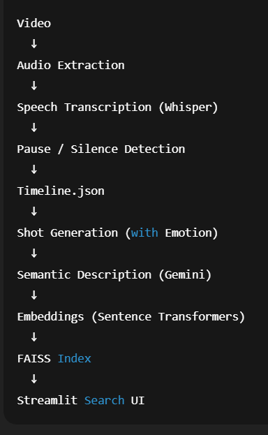
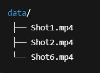

## 🎬 Editor Search Engine

An AI-powered system that allows video editors and creators to search large video collections by meaning, emotion, and narrative intent — not just keywords.

This project automatically:

    Processes raw videos

    Extracts audio → transcripts → pauses

    Builds semantic “shots”

    Indexes them using FAISS

    Enables natural language search via a Streamlit UI

## 🚀 Key Features

    🔍 Semantic Search – Find scenes by intent (e.g. “hero becomes villain”)

    🧠 Emotion Understanding – Emotion & tone inferred using CNN + VGG16 ensemble model

    🎞️ Editor-Friendly UI – Instantly preview the correct video

    ⚡ Fast Retrieval – FAISS vector search with sentence embeddings

    🔁 Incremental Indexing – New videos are added without reprocessing old ones

    📜 Shot Re-ranking – Uses RapidFuzz to reorder shots based on script similarity

    🔐 Secure API Handling – Gemini API keys loaded from .env

## 🧩 System Architecture

## 🔐 Environment Setup

1️⃣ Create virtual environment

    python -m venv cineAIvenv
    source cineAIvenv/bin/activate  
    cineAIvenv\Scripts\activate

2️⃣ Install dependencies

    pip install -r requirements.txt

3️⃣ Add Gemini API keys

    GEMINI_API_KEYS=XXXXXXXXXXXX,YYYYYYYYYYYYY

Multiple keys are supported and rotated automatically when quota is hit.

## 🎥 Video Files (Important)

🚫 Video files are NOT included in this repository due to GitHub size limits.

Place your videos here:

The system links videos using stored paths like:

    "source_video": "data/Shot6.mp4"

## ▶️ Running the Full Pipeline (One Command)

This runs everything end-to-end:

-python run_full_system.py

What it does:

    Extracts audio from videos

    Generates transcripts

    Detects pauses

    Creates timeline.json

    Builds shots

    Generates embeddings

    Updates FAISS index (incremental)

## 🖥️ Launch the Web App

    cd semantic-transcript-search
    streamlit run app.py

    
    Then open: http://localhost:8501

## 🔎 Example Queries

Try searching with:

    “friend confronting another about wasted potential”

    “intense courtroom argument”

    “hero turning into a villain”

    “hostile argument between couple”

The most semantically relevant scene will be shown with video preview.

## 🧠 Shot Re-Arrangement (Script-Based)

Using RapidFuzz, shots can be reordered based on similarity with a movie script.

    python arranging_shots/arranging.py

Useful for:

    Matching screenplay order

    Rebuilding narrative timelines

    Editor workflows

## 🛠️ Technologies Used

    Python

    Streamlit – Frontend

    FAISS – Vector search

    Sentence Transformers – Embeddings

    Google Gemini API –  semantic description

    CNN + VGG16 - Emotion detection in frames

    Faster-Whisper – Transcription

    RapidFuzz – Shot reordering

    MoviePy – Audio extraction

    🎯 Use Cases

## 🎬 Film & video editing

    📺 Media archives

    🎞️ Content moderation

    🧪 Research in video understanding

    🎓 Academic & capstone projects

## ⚠️ Notes & Limitations

    Gemini API has rate limits → handled via key rotation

    Videos must exist locally

## 🏆 Project Status

✅ Fully working
✅ Modular pipeline
✅ Deployment-ready
✅ Editor-friendly UI

## 🙌 Authors

    Durga Prasad Kavali

    Vamsi Krishna Bhumireddy Tippaiahgari

    Estasiddhi Karthik

## 🤝 Open for Contributions

PRs, issues, and cool ideas are always welcome!  
If you spot a bug, have an improvement, or just want to make this project cooler — jump in 🚀😄
